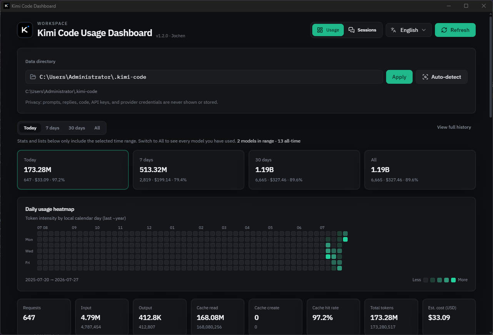

# Kimi Code 用量看板

[](./LICENSE)
[](#桌面端-tauri)
[](https://nodejs.org/)
[](https://react.dev/)
[](https://vitejs.dev/)
[](https://tailwindcss.com/)
[](https://www.rust-lang.org/)
[](#桌面端-tauri)

[English](./README.md) · **简体中文**

本地隐私安全的 [Kimi Code](https://www.kimi.com/) CLI 用量看板
（`~/.kimi-code` · Windows `%USERPROFILE%\.kimi-code`）。

只读取 `usage.record` 中的**模型名、时间与 Token 数量**，以及 `config.toml` 内受限的模型别名。
**不**展示或记录提示词、回复、代码、API Key、Provider 凭据。



## 功能

- **Token 分项** — 普通输入（`inputOther`）、输出、缓存读取、缓存创建
- **时间范围** — 今天 / 近 7 天 / 近 30 天 / 全部
- **图表与表格** — 每日趋势（多模型 SVG 曲线）、模型统计、缓存命中率、最近请求、近一年热力图
- **多语言** — 简体中文与英文；自动识别系统语言，可在应用内切换
- **费用估算** — 按 [Kimi API Platform](https://platform.kimi.ai/) 官方标价（USD / 百万 Token）
- **模型映射** — `config.toml` 别名、`KIMI_MODEL_NAME` / `KIMI_MODEL_PROVIDER` / `KIMI_MODEL_ID`、`__kimi_env_model__`
- **数据目录** — 自动识别 `KIMI_CODE_HOME`、`~/.kimi-code`、Windows 用户目录；也可在界面手动选择
- **会话管理** — 按工作区列会话，归档 / 恢复、永久删除（单条或批量）、安全文本预览（不含工具详情与凭据）、删除空工作区
- **桌面端（可选）** — Tauri 2（Windows / macOS / Linux），界面与 Web 一致；完整 Rust 数据管道实现；GitHub Actions 可多系统构建

## 默认扫描目录

| 平台 | 路径 |
| --- | --- |
| macOS / Linux | `~/.kimi-code` |
| Windows | `%USERPROFILE%\.kimi-code` |

可通过环境变量 `KIMI_CODE_HOME`、命令行 `--home` / `--dir` 或界面路径控件覆盖。

## 环境要求

- **Web / Node 服务：** Node.js **18+**
- **桌面端（可选）：** Rust stable、[Tauri CLI 2](https://v2.tauri.app/)、系统 WebView（Windows 需 WebView2）

## 快速开始（Web）

```bash
cd kimicode-dashboard
npm install
npm run build    # 构建前端到 dist/
npm start        # 本机 API + 静态页，127.0.0.1:3847
```

浏览器打开 **http://127.0.0.1:3847/**

### 开发模式（一条命令起 API + Vite）

```bash
npm run dev
# API  : http://127.0.0.1:3847/
# Web  : http://127.0.0.1:5173/  （/api 自动代理到后端）
```

如需拆分进程：`npm run dev:api` / `npm run dev:web`。

```bash
# 指定数据目录与端口
node src/server.js --home "C:\Users\you\.kimi-code" --port 3847 --no-open

# 查看全部选项
node src/server.js --help
```

### CLI 选项

| 选项 | 说明 |
| --- | --- |
| `--home`, `--dir <path>` | Kimi Code 数据目录（默认自动检测） |
| `--port`, `-p <n>` | 服务端口（默认 3847） |
| `--host <host>` | 绑定地址（默认 127.0.0.1） |
| `--no-open` | 启动时不自动打开浏览器 |
| `-h`, `--help` | 打印帮助信息 |

## 桌面端（Tauri）

```bash
npm install
npm run build          # 打包前端资源
npm run tauri:dev      # 桌面开发窗口
npm run tauri:build    # 安装包输出在 desktop/src-tauri/target/
```

桌面端用 **Rust** 完整实现了后端数据管道（扫描、聚合、定价、会话管理、热力图），JSON 形状与 Node `/api/*` 端点一致。前端通过 `@tauri-apps/api` invoke 调用，由 `web/src/lib/backend.js` 透明切换。

CI：`.github/workflows/desktop.yml` 在 Windows / Ubuntu / macOS 构建（`v*` 标签可发 Release 产物）。

## 界面技术栈

- React + Vite + Tailwind
- shadcn 风格组件（Radix Dialog、Select、Tabs、Tooltip、ScrollArea + CVA）
- Linear 风格暗色主题、青绿强调色、细滚动条
- Framer Motion 入场动效（尊重 `prefers-reduced-motion`）
- 用量页与会话页同壳 SPA 切换（`/` 和 `/sessions` 路由）

### Vite 配置

- 根目录：`web/`，静态资源目录：`web/public-assets/`
- `@` 别名指向 `web/src/`
- `base: "./"` 保证相对路径资源加载（兼容 Tauri 自定义协议）
- 开发服务器将 `/api` 代理到 `http://127.0.0.1:3847`
- 构建输出：`dist/`

### 会话管理

- 顶栏进入 **会话**
- 工作区目录：`sessions/wd_*`
- 归档路径：`sessions/.kcd-archive/<workspace>/`
- 会话预览对话框：仅展示截断的用户/助手文本 — 不展示工具 dump、不展示密钥；从 `context.append_message`、`turn.steer`/`turn.prompt` 和 `content.part` 事件重建
- 批量操作：多选、批量归档 / 取消归档 / 删除
- 删除会移出磁盘，并尽量清理 `session_index.jsonl` 对应行
- 空工作区删除：移除工作区目录并更新 `workspaces.json`（仅当无会话时可操作）

### 每日趋势图

- SVG 多系列折线图（640×200 viewBox，响应式）
- Top 6 模型显示为独立彩色曲线，其余归为"其他模型"
- 可通过药丸按钮切换显示/隐藏系列；悬停十字准线显示详情
- ~3 个月范围内填充连续日历日，更长时间范围仅显示有活动日期

### 热力图

- GitHub 风格贡献热力图，覆盖最近 53 周
- 单元格按 Token 使用量分为 5 个强度等级，悬停显示日期、Token、费用、缓存命中率
- 顶部月份标签

## 数据来源

扫描 `<home>/sessions/**/wire.jsonl`（跳过 `blobs/` 和 `tasks/` 目录），仅汇总类似：

```json
{
  "type": "usage.record",
  "model": "provider/model",
  "usage": {
    "inputOther": 0,
    "output": 0,
    "inputCacheRead": 0,
    "inputCacheCreation": 0
  },
  "usageScope": "turn",
  "time": 0
}
```

仅累计 `usageScope === "turn"`，避免与 session 级汇总重复计数。

模型映射读取 `config.toml` 的 `default_model` 与 `[models."…"]` 的 `provider` / `model` / `display_name`，以及环境变量 `KIMI_MODEL_NAME`、`KIMI_MODEL_PROVIDER`、`KIMI_MODEL_ID`（对应 `__kimi_env_model__`）。疑似密钥字段会在使用前剥离。

## 费用参考表

单位：USD / **百万** Token（以 [platform.kimi.ai](https://platform.kimi.ai/) 为准）：

| 模型 | Cache hit | Input | Output | 上下文 |
| --- | ---: | ---: | ---: | ---: |
| kimi-k3 | 0.30 | 3.00 | 15.00 | 1,048,576 |
| kimi-k2.7-code | 0.19 | 0.95 | 4.00 | 262,144 |
| kimi-k2.6 | 0.16 | 0.95 | 4.00 | 262,144 |
| kimi-k2.5 | 0.10 | 0.60 | 3.00 | 262,144 |
| kimi-k2-turbo | 0.15 | 1.15 | 8.00 | 262,144 |
| kimi-k2 | 0.15 | 0.60 | 2.50 | 262,144 |

非 Kimi 模型回退到 K2.6 标价，并在界面标记为「估算」。

## 脚本

| 脚本 | 说明 |
| --- | --- |
| `npm start` | 提供 API + 构建后的 UI（`127.0.0.1:3847`） |
| `npm run dev` | 同时启动 API 与 Vite 热更新（通过 `concurrently`） |
| `npm run dev:api` | 仅启动 API 服务（`--port 3847 --no-open`） |
| `npm run dev:web` | 仅启动 Vite 开发服务器 |
| `npm run build` | 生产前端 → `dist/` |
| `npm run preview` | Vite 预览构建产物 |
| `npm test` | Node 测试套件（`node --test test/*.test.js`） |
| `npm run tauri:dev` | Tauri 桌面开发 |
| `npm run tauri:build` | Tauri 发布包（未签名） |

## 隐私

- 不上传任何数据 — 默认只绑定 **`127.0.0.1`**
- 用量链路不解析消息正文、工具参数全文、日志全文
- 界面不读取或不展示 API Key / Provider 凭据
- 会话预览会对疑似密钥模式（API Key、SSH 私钥）做脱敏
- `config.toml` 中匹配 `api_key`、`token`、`secret`、`password`、`authorization` 的行在模型别名解析前即被剥离

## 协议

本项目采用 [MIT 协议](./LICENSE) 开源，点击可查看完整许可文本。